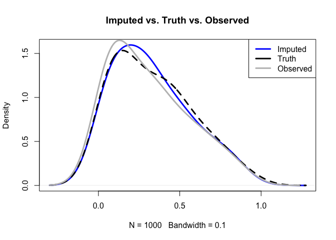
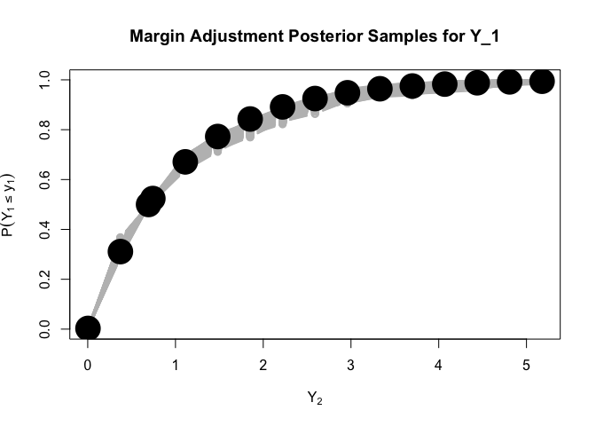
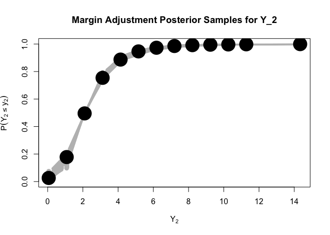

<!-- README.md is generated from README.Rmd. Please edit that file -->

# EHQLImpute

<!-- badges: start -->
<!-- badges: end -->

The EHQL Gaussian copula is a powerful tool for imputing nonignorable
missing data with arbitrary marginal distributions. The model provides
the ability to incorporate **auxiliary quantiles** for each study
variable based on subject matter expertise, published statistics, or a
sensitivity analysis. The model leverages this information in model
fitting, and imputes missing data using an estimator of each marginal
based, in part, by these auxiliary quantiles. In what follows we will
walk you through a toy example where we simulate data, fit the EHQL
copula model and impute missing data. The function $\verb|EHQLImpute|$
accomplishes these tasks.

## Installation

You can install the development version of EHQLImpute from
[GitHub](https://github.com/) with:

``` r
# install.packages("devtools")
devtools::install_github("jfeldman396/EHQL-Impute")
```

``` r
library(EHQLImpute)
```

## Simulating toy data

We will start by simulating data with non-ignorable missingness from a
Gaussian copula with arbitrary marginal distribution functions. We begin
by simulating $(\boldsymbol Y,\boldsymbol R)$, and removing values
$\boldsymbol Y_{ij}$ for $R^{2}_{ij}>0$.

$=(0,\{\tau_{j}^{q}\}_{q=1}^{l-1},...,1)$

``` r
  library(LaplacesDemon)
  # simulate data generating copula correlation
  C_prior = diag(1,10)
  C_0= cov2cor(LaplacesDemon::rinvwishart(15, C_prior))
  
  # create intercept vector to encode marginal missingness: we'll use 50\% marginal missingness in this example. Recall that \alpha will be 0 for indices corresponding to Y. We'll have non-ignorable missingness for each study variable (p = 5)
  
  alpha  = c(rep(0,5),rep(qnorm(0.5),5))
  
  # Generate latent variables: we'll simulate 1000 observations
  library(MASS)
  Z <- MASS::mvrnorm(1000,mu = alpha, Sigma = C_0)
  
  # Create R
  
  R <- t(apply(Z[,6:10],1,function(z) ifelse(z>0,1,0)))
  
  #look at marginal incidence of missingness
  print("Missingness in Each Y_j:")
#> [1] "Missingness in Each Y_j:"
  print(colMeans(R))
#> [1] 0.502 0.506 0.501 0.499 0.491

  # Now we'll create the study variables. Here we use gamma, t, and beta marginals 
  
      Y_raw =NULL
      ind = 1
      
      for(j in 1:5){
        # the sequence of marginals goes gamma, t, beta
        if(ind == 1){
          Y_j= qgamma(pnorm(Z[,j]),1,1)
        
          
        }else if(ind == 2){
          Y_j = qt(pnorm(Z[,j]),5,2)
       
          
        }else if(ind == 3){
          Y_j<-qbeta(pnorm(Z[,j]),1,2)
        
        }
        if(ind == 3){
          ind = 1
        }else{
          ind = ind+1
        }
        Y_raw = cbind(Y_raw,Y_j)
      }
      
      # remove values based on R = 1
      Y_raw[which(R ==1, arr.ind = T)] = NA
      
      #join Y and R to get observed data
      Y_obs=cbind(Y_raw,R)
      print("Summary of (Y^obs, R)")
#> [1] "Summary of (Y^obs, R)"
      print(summary(Y_obs))
#>       Y_j              Y_j              Y_j              Y_j        
#>  Min.   :0.0064   Min.   :-1.404   Min.   :0.0002   Min.   :0.0013  
#>  1st Qu.:0.3779   1st Qu.: 1.012   1st Qu.:0.1237   1st Qu.:0.4210  
#>  Median :0.8185   Median : 1.647   Median :0.2566   Median :0.9263  
#>  Mean   :1.1339   Mean   : 1.798   Mean   :0.3111   Mean   :1.2666  
#>  3rd Qu.:1.5007   3rd Qu.: 2.450   3rd Qu.:0.4597   3rd Qu.:1.7452  
#>  Max.   :6.5352   Max.   : 6.478   Max.   :0.9324   Max.   :7.1052  
#>  NA's   :502      NA's   :506      NA's   :501      NA's   :499     
#>       Y_j               V6              V7              V8       
#>  Min.   :-1.321   Min.   :0.000   Min.   :0.000   Min.   :0.000  
#>  1st Qu.: 1.068   1st Qu.:0.000   1st Qu.:0.000   1st Qu.:0.000  
#>  Median : 1.687   Median :1.000   Median :1.000   Median :1.000  
#>  Mean   : 1.795   Mean   :0.502   Mean   :0.506   Mean   :0.501  
#>  3rd Qu.: 2.361   3rd Qu.:1.000   3rd Qu.:1.000   3rd Qu.:1.000  
#>  Max.   : 9.287   Max.   :1.000   Max.   :1.000   Max.   :1.000  
#>  NA's   :491                                                     
#>        V9             V10       
#>  Min.   :0.000   Min.   :0.000  
#>  1st Qu.:0.000   1st Qu.:0.000  
#>  Median :0.000   Median :0.000  
#>  Mean   :0.499   Mean   :0.491  
#>  3rd Qu.:1.000   3rd Qu.:1.000  
#>  Max.   :1.000   Max.   :1.000  
#> 
```

## Estimating the EHQL copula

Now we’ll estimate the EHQL copula. To do so requires several pieces of
information specified by the user:

- **YR**: This is the combined observed study variables and missingness
  indicators. It is given by $\texttt{Yobs}$ above.
- **ncolY**: The number of study variables. In this example we have
  $\texttt{ncolY} = 5$:
- **ncolR**: The number of study variables modeled as non-ignorable. In
  this example we have $\texttt{ncolR} = 5$
- **aux_quantiles**: auxiliary quantiles assumed known for each study
  variable. This is a list of length $\texttt{ncolY}$, where the
  aux_quantiles\[\[j\]\]
  $=(0,\{\tau_{j}^{q}\}_{q=2}^{\ell_{j} - 1},...,1)$, i.e. there are
  $\ell_{j}+2$ auxiliary quantiles assumed known for each variable. Note
  that $\ell_{j}$, the number of auxiliary quantiles for each variable,
  may be unique, while $\tau^{1}_{j} = 0$ and $\tau^{\ell_{j}} = 1$.
  aux_quantiles\[\[j\]\] is null, empirical deciles will be used.
- **aux_infos**: This is a list of length $\texttt{ncolY}$ where
  aux_infos\[\[j\]\]
  $= \{F_{j}^{-1}(0),\{F_{j}^{-1}(\_tau_{j}^{q})\}_{q=2}^{\ell_{j}},...,F_{j}^{-1}(1)\}$
- **MA**: vector of length ncolY indicating whether or not to compute
  the margin adjustment. This is strongly recommended for all levels of
  auxiliary information, and especially when auxiliary information is
  extremely sparse, as it propagates uncertainty about each $F_{j}$
  which is beneficial for prediction and imputation
- **nImps**: The number of completed data sets to create
- **nsamp**: Number of iterations for the MCMC
- **burn**: Burn-in iterations for the MCMC

``` r
YR = Y_obs
ncolY = 5; ncolR = 5
MA = rep(T,5)
aux_quantiles = vector('list',5)
aux_infos = vector('list',5)

for(j in 1:5){
  aux_quantiles[[j]] = c(0,0.5,1) #assume access to the median
  if(j ==1 | j == 4){
    aux_infos[[j]] = qgamma(aux_quantiles[[j]],1,1)
  }else if(j ==2 |j == 5){
    aux_infos[[j]] = qt(aux_quantiles[[j]],5,2)
  }else{
    aux_infos[[j]] = qbeta(aux_quantiles[[j]],1,2)
  }
  
}

imps<- EHQLImpute(YR,
                  ncolY,
                  ncolR,
                  aux_quantiles = aux_quantiles,
                  aux_infos = aux_infos,
                  MA = MA,
                  nImps = 20,
                  nsamp = 5000,
                  burn =4000)
#> Sampling is: 20 percent doneNULL
#> Sampling is: 40 percent doneNULL
#> Sampling is: 60 percent doneNULL
#> Sampling is: 80 percent doneNULL
#> Sampling is: 100 percent doneNULL
```

## Analyze results

Now, we can look at the imputations

``` r
summary(imps$YImpute[[2]])
#>       Y_j                Y_j                Y_j                 Y_j          
#>  Min.   :0.002831   Min.   :-0.01022   Min.   :-0.000099   Min.   :0.002214  
#>  1st Qu.:0.295708   1st Qu.: 1.43534   1st Qu.: 0.132760   1st Qu.:0.299862  
#>  Median :0.738075   Median : 2.16926   Median : 0.286881   Median :0.655321  
#>  Mean   :1.082782   Mean   : 2.43558   Mean   : 0.328149   Mean   :1.065591  
#>  3rd Qu.:1.559143   3rd Qu.: 3.01529   3rd Qu.: 0.486232   3rd Qu.:1.576546  
#>  Max.   :5.177720   Max.   :14.33562   Max.   : 0.973536   Max.   :7.032586  
#>       Y_j         
#>  Min.   :-0.5853  
#>  1st Qu.: 1.2763  
#>  Median : 2.1431  
#>  Mean   : 2.4003  
#>  3rd Qu.: 3.2401  
#>  Max.   :25.7541

plot(density(imps$YImpute[[2]][,3], bw = .1),col = "blue", lwd = 3, main = "Imputed vs. Truth vs. Observed")
lines(density(rbeta(1000,1,2),bw = .1),lwd = 3, lty = 2)
lines(density(Y_raw[,3],na.rm = T, bw = .1), lwd = 3, col = "gray")
legend("topright", c("Imputed", "Truth", "Observed"), col= c("blue", "black", "gray"), lwd = 3)
```



We see that the imputations correct bias in the observed data.

### Analyze margin Adjustment

``` r
# 


  for( j in 1:3){

    if(j == 2){
    plot(imps$x_ma[[j]],imps$MAs[[j]][1,], type = 'n', xlab = expression(Y[2]),
         ylab = expression(paste(P(Y[2]<=y[2]))),
         main =paste("Margin Adjustment Posterior Samples for Y_2"),
         ylim = c(0,1),
         lwd = 3, 
         cex = 2)
    }else if(j==1){
      plot(imps$x_ma[[j]],imps$MAs[[j]][1,], type = 'n', xlab = expression(Y[2]),
         ylab = expression(paste(P(Y[1]<=y[1]))),
         main =paste("Margin Adjustment Posterior Samples for Y_1"),
         ylim = c(0,1),
         lwd = 3, 
         cex = 2)
    }else{
      plot(imps$x_ma[[j]],imps$MAs[[j]][1,], type = 'n', xlab = expression(Y[2]),
         ylab = expression(paste(P(Y[3]<=y[3]))),
         main =paste("Margin Adjustment Posterior Samples for Y_3"),
         ylim = c(0,1),
         lwd = 3, 
         cex = 2)
    }
    sapply(1:1000, function(i)
      lines(imps$x_ma[[j]], imps$MAs[[j]][i,], type = "b", col = "gray", lwd = 2))
    if(j == 1){
      points(imps$x_ma[[j]],pgamma(imps$x_ma[[j]],1,1), pch = 16, cex =4)
    }else if(j == 2){
      points(imps$x_ma[[j]],pt(imps$x_ma[[j]],5,2), pch = 16, cex = 4)
    }else{
      points(imps$x_ma[[j]],pbeta(imps$x_ma[[j]],1,2), pch = 16, cex = 3)
    }

  }
```


